 

**Founder-led engineering for businesses that need the system—not another slide deck.**

## I build the machinery behind the business

I’m **Mike**, founder of **MEnterprise Firm Inc** in Warren, Ohio. I turn operational friction into deployable software: custom SaaS products, workflow automation, payment infrastructure, AI-assisted operator tools, APIs, and internal control systems.

| Capability | What that means in practice |
| --- | --- |
| **Business systems** | Dashboards, admin platforms, intake, workflow automation, APIs, and integrations |
| **Commerce infrastructure** | Checkout experiences, payment rails, evidence ledgers, and self-custody tooling |
| **AI operator tools** | Analysis, content operations, lead workflows, triage, and decision support |
| **Developer infrastructure** | Repository intelligence, deployment tooling, release systems, SDKs, and control planes |

## Selected systems

| Project | Purpose | Explore |
| --- | --- | --- |
| **ReUp** | Business-facing product and commerce workflow | [Source](https://github.com/MEF-works/reup-mini-new) |
| **Repo Recon** | Repository intelligence packaged for developer workflows | [Source](https://github.com/MEF-works/repo-recon) · [npm](https://www.npmjs.com/package/repo-recon) |
| **Visibility Machine** | AI-assisted content operations, metrics, persistence, and lead management | [Source](https://github.com/MEF-works/visibility-machine) |
| **SovSats** | Self-custody Bitcoin checkout UX for BTCPay Server | [Source](https://github.com/MEF-works/sovsats) · [Product](https://sovsats.com) |
| **Statement Analyzer** | Structured document and financial-data analysis | [Source](https://github.com/MEF-works/statement-analyzer) |
| **SovereignStack** | Commerce and payment infrastructure for higher-friction businesses | [Platform](https://sovereignstack.pro) |

> MEF also maintains private systems containing proprietary business logic, infrastructure, and client-sensitive architecture. Public repositories are deliberately selected to demonstrate capability without exposing protected assets.

## Live build activity

<picture>
  <source media="(prefers-color-scheme: dark)" srcset="https://raw.githubusercontent.com/MEF-works/MEF-works/output/mef-contribution-stream.svg" />
  <source media="(prefers-color-scheme: light)" srcset="https://raw.githubusercontent.com/MEF-works/MEF-works/output/mef-contribution-stream-light.svg" />
  
</picture>

Real contribution history · regenerated daily

## Engineering stack

## Put MEF to work

Bring me the bottleneck, unfinished product, manual workflow, or missing infrastructure. I’ll map the problem, show the implementation path, and build the system.

### Preview → Deposit → Custom Build

[**Browse software inventory**](https://sale.sovereignstack.pro) · [**View portfolio**](https://builtbymef.pro) · [**Email Mike**](mailto:mike@mefworks.com)

[Company](https://menterprisefirminc.com) · [SovPay](https://sovpay.me) · [SovSats](https://sovsats.com) · [SovereignStack](https://sovereignstack.pro)

MEFWorks™ — Elite Systems Engineering · MEnterprise Firm Inc

